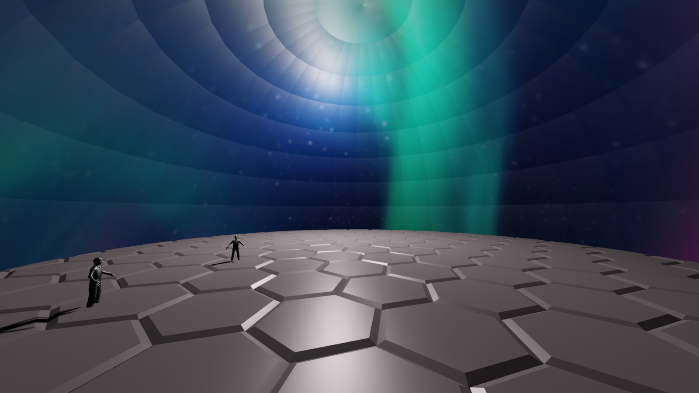
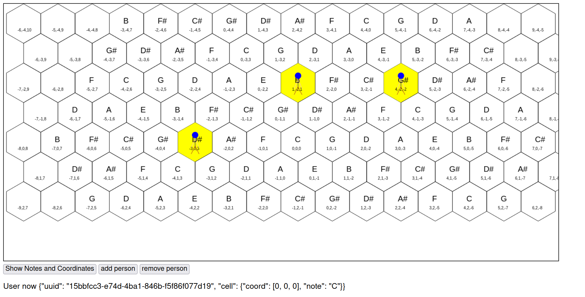
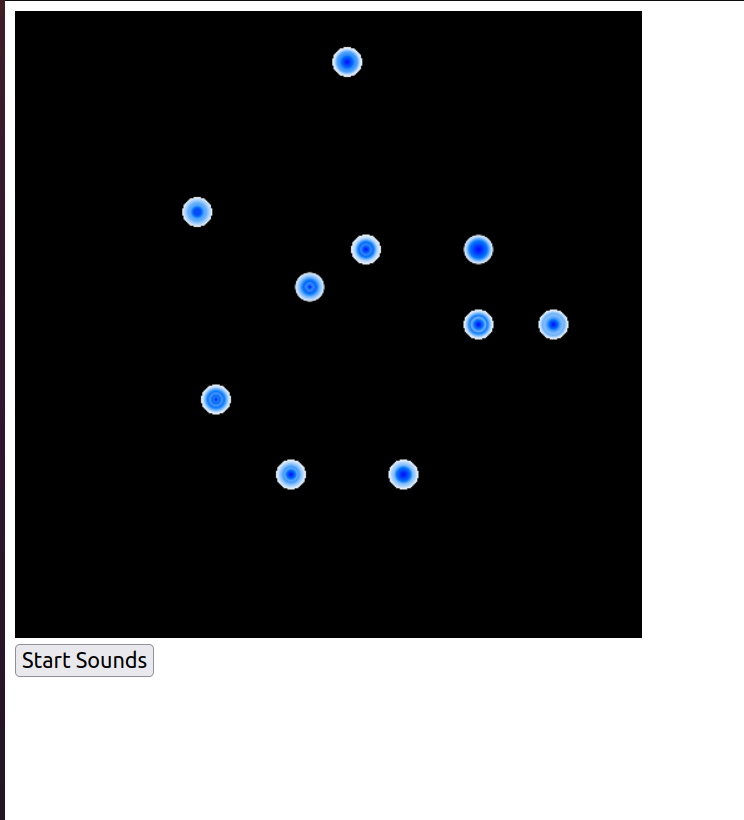

# Honeycomb Visual Tonnetz

This repo contains the protoptype for the Visual Tonnetz installation created for University of Bristol CSS Arthack 2023

This was created with Suet and Khulud

This can be run with (requires flask, numpy and muscpy)

```
python server.py
```

## Idea



The above is a Blender render of a room scale installation which would comprise Visual Tonnetz. It is comprised of a hexagonal touch sensitive floor, speakers and a visual projection dome. Participants would walk around and experience music and visuals informed by their location in the space. 

This is inspired by Tonnetz which is a hexagonal representation of musical notes where notes are related by pre-defined intervals on a hexagonal grid. The system would then randomly play notes sampled from the current location of participants. The visuals then both correspond to the participants location, and to a number of other factors including musical consonance/dissonance, relative location, motion among other things. 

## Prototype

For this art hack, we wanted to create a prototype in which we could demonstrate the link between participant location, music generation and visuals. We achieved this through the use of HTML Canvas and Python Flask server. 

### Interaction



The `interaction` endpoint generates this hexagonal grid onto the screen. Pressing show notes shows the note that each grid cell represents, corresponding to the grid generated in the backend. The integers represent the grid coordinate in cube notation.

Pressing add person adds a person to the center of the grid. A person can then be moved around by dragging and dropping the icon with the mouse.

### Visuals and Sounds



To start off simply, the idea of stars is used with the visualisation pulsing stars based on particpant location and the note that is played.

Audio generation was attempted with tone.js but is not quite yet functional.

## Moving forward

The idea has merit but needs a full experience to understand its effectiveness. The scenario should be recreated in a games engine such as Unreal or Unity to fully explore the experience. 